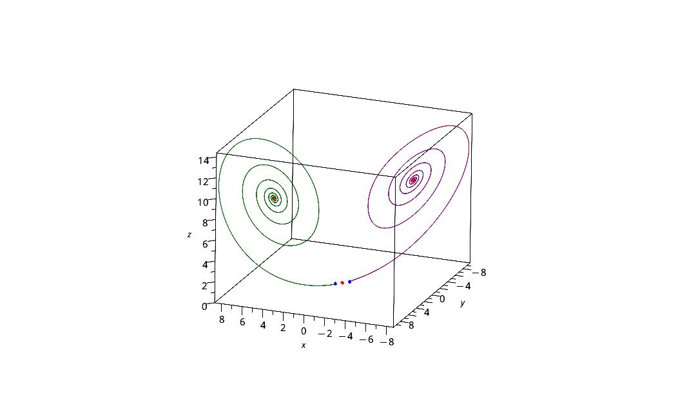
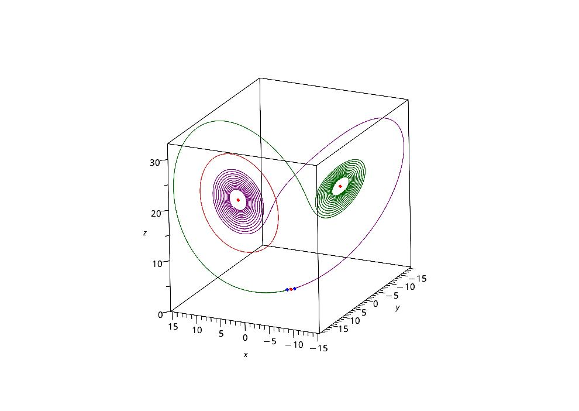
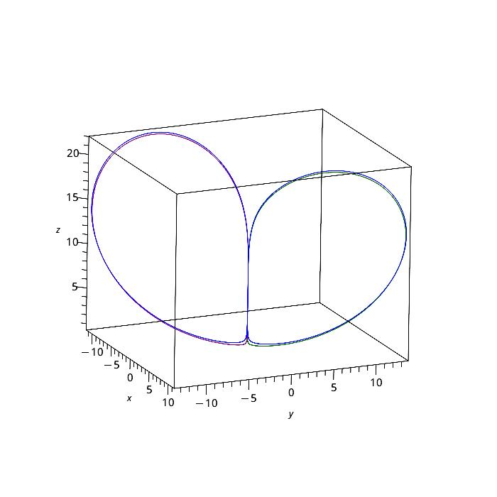
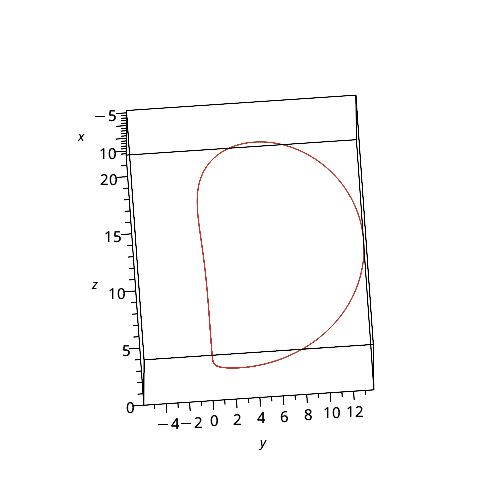
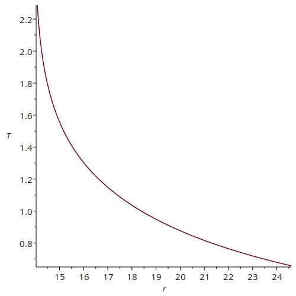

# Lorenz system and periodic orbits

In this project we will explore the dynamics of the Lorenz system, which is a very drastic reduction of the Rayleigh-Benard problem of thermal convection. The system is:

$$
\begin{aligned}
\dot{x} &= \sigma(y-x) \\
\dot{y} &= rx-y-xz \\
\dot{z} &= xy-bz
\end{aligned}
$$

In particular, we explore the creation and destruction of a set of periodic orbits that exist for $\sigma=10$, $b=8/3$, and varying $r$ between 13 and 25.

We now show some results of the project.

<!-- add image with title -->

